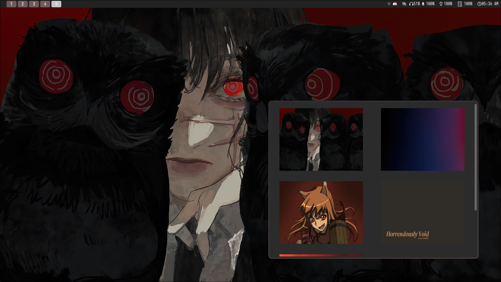

# PyWpp - Lightweight Hyprland Wallpaper Changer

    
Please, attention to requirements.

    <ul>
        <li>Python 3+</li>
        <li>CustomTkinter</li>
        <li>Pillow</li>
    </ul>

    
Script Setup.

    <ul>
        <li>Create a directory on your ~/home named "Wallpapers", if not, the
            script will...</li>
        <li>Put your wallpapers there, it'll detect automatically on the startup
        of the script!</li>
        <li>Run and Enjoy.</li>
    </ul>

<figure>
    
    <figcaption>It is extension agnostic!</figcaption>
</figure>
